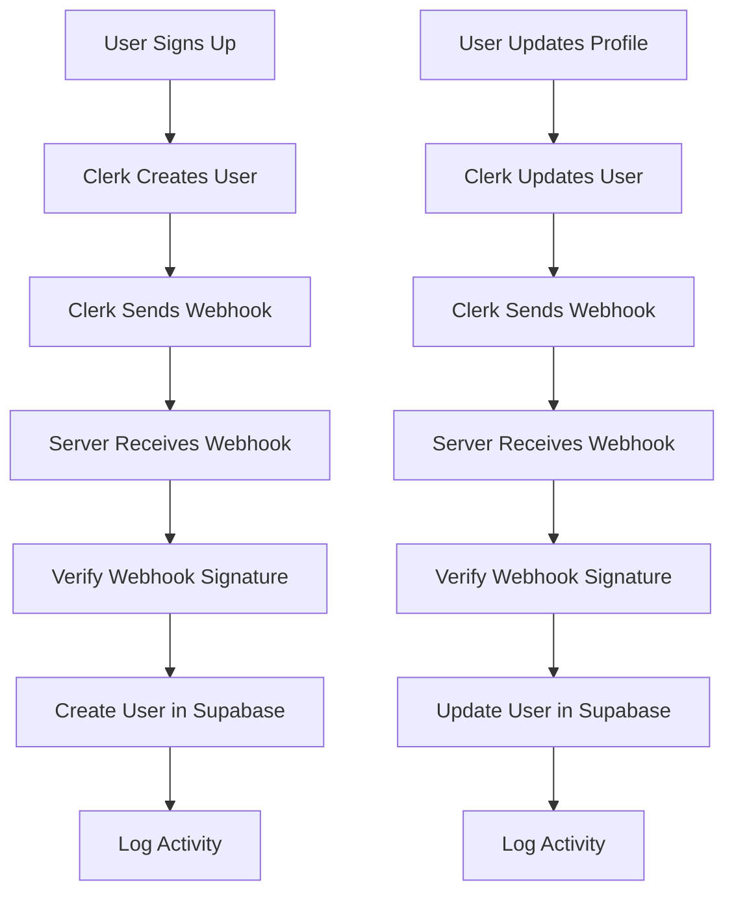

# Clerk Webhook Setup Guide

## 🎯 Overview

This guide explains how to configure Clerk webhooks to automatically sync user data between Clerk and your Supabase database.

## 📋 Prerequisites

- ✅ Clerk account with publishable and secret keys configured
- ✅ Supabase database with user tables set up
- ✅ Server running with webhook endpoint available

## 🔧 Webhook Configuration

### 1. Clerk Dashboard Setup

1. **Login to Clerk Dashboard**
   - Go to [https://dashboard.clerk.com](https://dashboard.clerk.com)
   - Select your project

2. **Navigate to Webhooks**
   - Go to "Webhooks" in the left sidebar
   - Click "Add Endpoint"

3. **Configure Endpoint**
   - **Endpoint URL**: `https://your-domain.com/api/webhooks/clerk-webhook`
   - **For local development**: Use ngrok or similar tool to expose localhost
   - **Events to Subscribe**: Select the following events:
     - `user.created`
     - `user.updated` 
     - `user.deleted`
     - `session.created`
     - `session.ended`

4. **Copy Webhook Secret**
   - After creating the endpoint, copy the webhook secret
   - It will look like: `whsec_...`

### 2. Environment Configuration

Update your `.env` file with the webhook secret:

```env
CLERK_WEBHOOK_SECRET=whsec_bhP9d/ho21QLIWeAN3SjkgYK1cBy9hBN
```

### 3. Local Development Setup

For local development, you'll need to expose your local server:

#### Option A: Using ngrok (Recommended)

1. **Install ngrok**
   ```bash
   npm install -g ngrok
   ```

2. **Expose local server**
   ```bash
   ngrok http 3000
   ```

3. **Use ngrok URL in Clerk**
   - Copy the HTTPS URL from ngrok (e.g., `https://abc123.ngrok.io`)
   - Use: `https://abc123.ngrok.io/api/webhooks/clerk-webhook`

#### Option B: Using Clerk CLI

1. **Install Clerk CLI**
   ```bash
   npm install -g @clerk/clerk
   ```

2. **Login to Clerk**
   ```bash
   clerk login
   ```

3. **Start development server with webhook tunneling**
   ```bash
   clerk dev --port 3000
   ```

## 🧪 Testing Webhooks

### 1. Test Webhook Endpoint

```bash
curl -X POST http://localhost:3000/api/webhooks/clerk-webhook \
  -H "Content-Type: application/json" \
  -d '{"test": "webhook"}'
```

### 2. Check Server Logs

Monitor your server logs for webhook events:

```bash
# Look for these log messages:
# 📨 Received Clerk webhook: user.created
# ✅ User created successfully in Supabase
```

### 3. Verify Database Sync

Check your Supabase database to ensure users are being created/updated:

```sql
SELECT * FROM users ORDER BY created_at DESC LIMIT 5;
```

## 📊 Webhook Events Handled

| Event | Description | Action |
|-------|-------------|---------|
| `user.created` | New user signs up | Creates user record in Supabase |
| `user.updated` | User profile updated | Updates user record in Supabase |
| `user.deleted` | User account deleted | Soft deletes user (marks inactive) |
| `session.created` | User signs in | Logs session activity |
| `session.ended` | User signs out | Logs session end |

## 🔍 Troubleshooting

### Common Issues

1. **Webhook not receiving events**
   - Check if webhook URL is accessible
   - Verify webhook secret is correct
   - Check server logs for errors

2. **User not created in Supabase**
   - Check Supabase connection
   - Verify user table schema
   - Check for database errors in logs

3. **Webhook verification failed**
   - Ensure webhook secret matches
   - Check if request headers are present
   - Verify request body format

### Debug Commands

```bash
# Check webhook endpoint
curl -I http://localhost:3000/api/webhooks/clerk-webhook

# Test with sample data
curl -X POST http://localhost:3000/api/webhooks/clerk-webhook \
  -H "Content-Type: application/json" \
  -H "svix-id: test-id" \
  -H "svix-timestamp: $(date +%s)" \
  -H "svix-signature: test-signature" \
  -d '{"type": "user.created", "data": {"id": "test", "email_addresses": [{"email_address": "test@example.com"}]}}'
```

## 🚀 Production Deployment

### 1. Update Webhook URL

In Clerk Dashboard, update the webhook URL to your production domain:

```
https://your-production-domain.com/api/webhooks/clerk-webhook
```

### 2. Environment Variables

Ensure production environment has:

```env
CLERK_WEBHOOK_SECRET=your_production_webhook_secret
CLERK_SECRET_KEY=your_production_secret_key
CLERK_PUBLISHABLE_KEY=your_production_publishable_key
```

### 3. Security Considerations

- ✅ Use HTTPS in production
- ✅ Verify webhook signatures
- ✅ Rate limit webhook endpoints
- ✅ Monitor webhook failures
- ✅ Set up alerts for webhook errors

## 📈 Monitoring

### Webhook Metrics

Monitor these metrics in production:

- Webhook delivery success rate
- Response time
- Error rate
- User sync accuracy

### Logging

The webhook handler logs all events:

```
📨 Received Clerk webhook: user.created
👤 Creating user in Supabase: user@example.com
✅ User created successfully in Supabase
```

## 🔄 User Synchronization Flow



## ✅ Checklist

- [ ] Clerk webhook endpoint configured
- [ ] Webhook secret added to environment variables
- [ ] Webhook events subscribed (user.created, user.updated, user.deleted)
- [ ] Local development setup with ngrok or Clerk CLI
- [ ] Webhook endpoint tested
- [ ] User synchronization verified
- [ ] Production webhook URL configured
- [ ] Monitoring and alerting set up

## 🆘 Support

If you encounter issues:

1. Check server logs for detailed error messages
2. Verify webhook configuration in Clerk Dashboard
3. Test webhook endpoint accessibility
4. Check Supabase database connection
5. Review environment variable configuration

For additional help, refer to:
- [Clerk Webhooks Documentation](https://clerk.com/docs/webhooks)
- [Supabase Documentation](https://supabase.com/docs)
- [Project README](./README.md)
